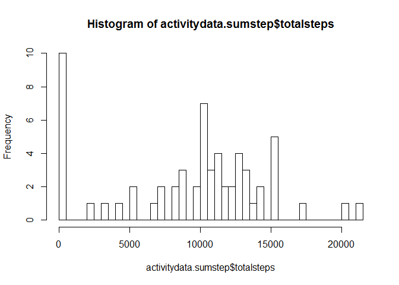
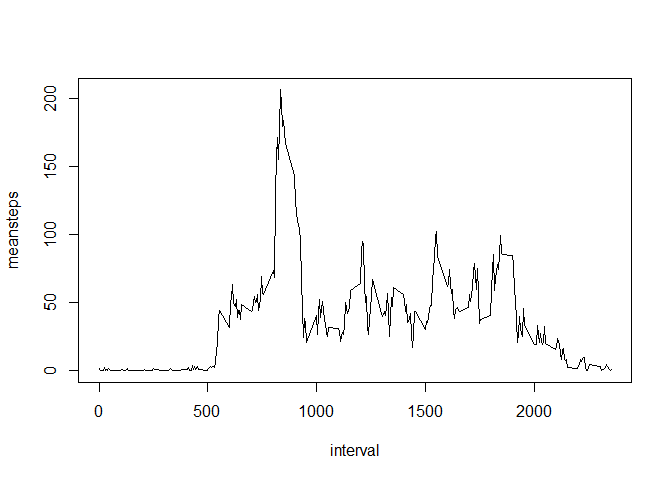
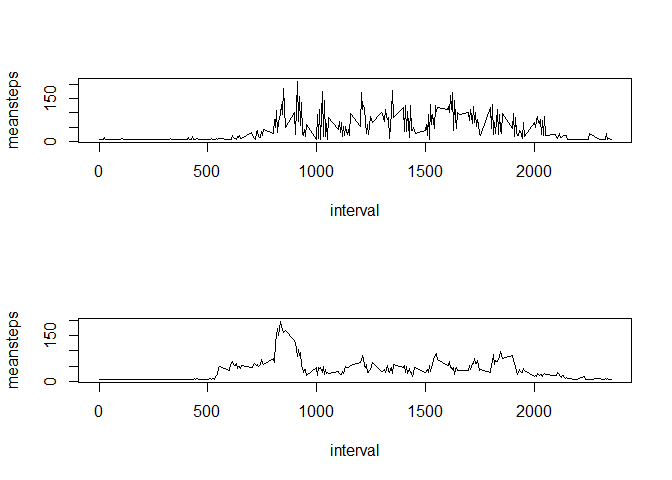

# Reproducible Research: Peer Assessment 1


## Loading and preprocessing the data

```r
orgwd <- getwd()
setwd("D:/Rcommon/RwdCoursera/repdata-012")
unzip("repdata-data-activity.zip")
activitydata <- read.csv("activity.csv")
```

## What is mean total number of steps taken per day?

```r
suppressMessages(library(dplyr))
activitydata.bydate <- group_by(activitydata, date)
activitydata.sumstep <- summarise(activitydata.bydate,  totalsteps = sum(steps,  na.rm=TRUE), meansteps = mean(steps, na.rm=TRUE))
hist(activitydata.sumstep$totalsteps, breaks=50)
```

 

```r
mean(activitydata.sumstep$totalsteps)
```

```
## [1] 9354.23
```

```r
median(activitydata.sumstep$totalsteps)
```

```
## [1] 10395
```


## What is the average daily activity pattern?
Plot of mean number of steps for each 5 minute interval

```r
activitydata.byinterval <- group_by(activitydata, interval)

plot(summarise(activitydata.byinterval, meansteps = mean(steps, na.rm=TRUE)), type="l")
```

 

Which 5 min interval has the highest mean number of steps 

```r
x <- (summarise(activitydata.byinterval, meansteps = mean(steps, na.rm=TRUE)))
x[which.max(x$meansteps), ]
```

```
## Source: local data frame [1 x 2]
## 
##   interval meansteps
## 1      835  206.1698
```
## Imputing missing values
How many rows are incomplete

```r
nrow(activitydata)-sum(complete.cases(activitydata))
```

```
## [1] 2304
```


```r
activitydataNAismean <- activitydata

for (i in which(sapply(activitydataNAismean, is.numeric))) {
    activitydataNAismean[is.na(activitydataNAismean[, i]), i] <- mean(activitydataNAismean[, i],  na.rm = TRUE)
}

activitydataNAismean.bydate <- group_by(activitydataNAismean, date)
activitydataNAismean.sumstep <- summarise(activitydataNAismean.bydate,  totalsteps = sum(steps,  na.rm=TRUE), meansteps = mean(steps, na.rm=TRUE))
hist(activitydataNAismean.sumstep$totalsteps, breaks=50)
```

 

```r
mean(activitydataNAismean.sumstep$totalsteps)
```

```
## [1] 10766.19
```

```r
median(activitydataNAismean.sumstep$totalsteps)
```

```
## [1] 10766.19
```
The impact of imputing missing values with the mean of total number of steps is that the median and mean get higher values.

## Are there differences in activity patterns between weekdays and weekends?

```r
test <- c("zaterdag", "zondag")
activitydataNAismean$datePW <- weekdays(as.Date(activitydataNAismean$date))
activitydata.weekend <- filter(activitydataNAismean, datePW == test)
activitydata.weekend$yesnoweekend <- 1

activitydata.weekdays <- filter(activitydataNAismean, datePW != test)
activitydata.weekdays$yesnoweekend <- 0


par(mfrow=c(2,1))
activitydata.weekend <- group_by(activitydata.weekend, interval)
plot(summarise(activitydata.weekend, meansteps = mean(steps, na.rm=TRUE)), type="l")
activitydata.weekdays <- group_by(activitydata.weekdays, interval)
plot(summarise(activitydata.weekdays, meansteps = mean(steps, na.rm=TRUE)), type="l")
```

 
